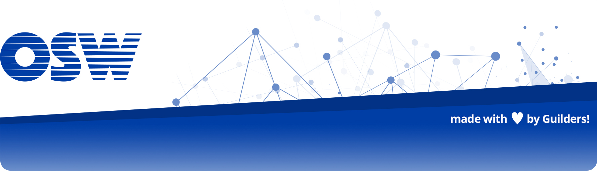

# OSWeekends Agile project Template

> Un punto de partida para organizar tu próximo proyecto usando nuestra metodología ágil dentro de un Guild.

En este repositorio almacenaremos todas las plantillas y recursos para inicializar un proyecto en Github como Guild :-)

**Motivación**

Queremos reducir la curva de entrada a nuev@s contributors en proyectos Open SOurce dentro de nuestra organización. Para ello hemos oeganizado plantillas que aterrizan toda nuestra filosofía de una manera facil y directa.

### Equipo

 - [ Theba Gomez (@KoolTheba)](https://github.com/integrante1) (Leader)
 - [ Jorge Baumann (@baumannzone)](https://github.com/baumannzone) (Contributor)
 - [ Borja Godoy (@borjagodoy)](https://github.com/borjagodoy) (Contributor)
 - [ Jacinto J. Cruz Nieto (@jacintoj)](https://github.com/jacintoj) (Contributor)
 - [ Victoria Solis (@vickysolo)](https://github.com/vickysolo) (Contributor)
 - [ Ulises Gascón(@ulisesgascon)](https://github.com/ulisesgascon) (Leader)
 - [ Irene M Morgado (@irnmm)](https://twitter.com/irnmm?lang=es) (Contributor)
 - [ Chelo Quilón (@lilxelo)](https://github.com/lilxelo) (Contributor)
 - [ Javier Gallego Martín (@bifuer)](https://github.com/bifuer) (Contributor)
 - [ Carlos Hernandez (@codingcarlos)](https://github.com/codingcarlos) (Contributor)

##### Agradecimientos

 - [ Ángel Corral Arias (@ancoar)](https://github.com/ancoar)

##### Necesitamos

_No tenemos posiciones abiertas por el momento_

### Demo

_No tenemos demo disponible por el momento_

### Tecnología utilizada

#### Dependencias
- **Plataforma de Github**: Para facilitar el clonado
- **Markdown**: Para mejorar la sintaxis y la semantica

### Como contribuir en el proyecto

**Más informacion en [CONTRIBUTING.md](CONTRIBUTING.md)**

### ¿Cómo usarlo?.

#### TL:DR;

1. Sigue los pasos del checklist para arrancar exitosamente tu proyecto dentro de un Guild

#### Lista de tareas (checklist) para arrancar un proyecto

**1: ¡Ser independiente!**
- [ ] ¡Tener ganas de compartir!
- [ ] Ser miembro de Slack
- [ ] Ser miembro de un Guild
- [ ] Ser miembro en Github de la organización Open Source Weekends
- [ ] Pedir en el canal de Slack #{{GUILDS}} que te creen un repositorio
- [ ] Confirmar que se ha creado y asignado un grupo de Github al repositorio

**2: ¡Arranca la aventura!Trabajando en tu repo**
- [ ] [Descargate este proyecto](https://github.com/OSWeekends/agile-project-template/archive/master.zip) como fichero .zip
- [ ] Añade únicamente la carpeta `.osweekends` a tu nuevo repositorio
- [ ] Crear un archivo `.gitignore` utilizando algún generador como [gitignore.io](https://www.gitignore.io/)
- [ ] ....

### Estado del proyecto.

_Desarrollo activo. Entrega prevista para el Sábado 17 de Marzo de 2018_

### Releases anteriores

_Primera release en desarrollo activo_

### Licencia

GNU General Public License v3.0

