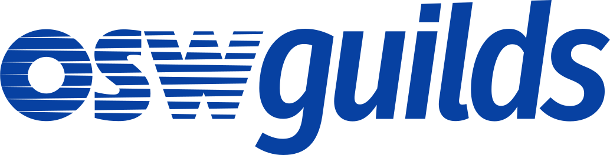

# OSWeekends Agile project Template

> Un punto de partida para organizar tu próximo proyecto usando nuestra metodología ágil dentro de un Guild.

En este repositorio almacenaremos todas las plantillas y recursos para inicializar un proyecto en Github como Guild :-)

**Motivación**

Queremos reducir la curva de entrada a nuev@s contributors en proyectos Open SOurce dentro de nuestra organización. Para ello hemos oeganizado plantillas que aterrizan toda nuestra filosofía de una manera facil y directa.

### Equipo

 - [ Theba Gomez (@KoolTheba)](https://github.com/integrante1) (Leader)
 - [ Jorge Baumann (@baumannzone)](https://github.com/baumannzone) (Contributor)
 - [ Borja Godoy (@borjagodoy)](https://github.com/borjagodoy) (Contributor)
 - [ Jacinto J. Cruz Nieto (@jacintoj)](https://github.com/jacintoj) (Contributor)
 - [ Victoria Solis (@vickysolo)](https://github.com/vickysolo) (Contributor)
 - [ Ulises Gascón(@ulisesgascon)](https://github.com/ulisesgascon) (Leader)
 - [ Irene M Morgado (@irnmm)](https://twitter.com/irnmm?lang=es) (Contributor)
 - [ Chelo Quilón (@lilxelo)](https://github.com/lilxelo) (Contributor)
 - [ Javier Gallego Martín (@bifuer)](https://github.com/bifuer) (Contributor)
 - [ Carlos Hernandez (@codingcarlos)](https://github.com/codingcarlos) (Contributor)

##### Necesitamos

{{Descripción de los perfiles necesarios para el proyecto que aun se necesitan}}.

 - {{Nombre del role}}: {{Definición de las tareas}}

### Demo

{{Información de donde puede verse funcionar... si es posible}}

### Tecnología utilizada

#### Dependencias
- **{{Nombre libreria/framework}}**: {{Explicación de su uso}}

### Como contribuir en el proyecto
{{Pequeña descripción motivante para enganchar con l@s potenciales Contributors}}

**Más informacion en [CONTRIBUTING.md](CONTRIBUTING.md)**

### ¿Cómo usarlo?.

#### TL:DR;

{{Definición rápida y sencilla de como descargarse el proyecto y empezar a trabajar con el en local}}

#### Instalación

{{Cómo hacer que funcione el proyecto en una máquina de forma local, descríbelo de forma detallada y paso por paso.}}

### Estado del proyecto.

{{Descripción del sprint actual y próxima entrega}}

### Releases anteriores

#### [{{Fecha}} {{Nombre release}} {{Version}}]({{Link a la release}})
- {{Feature añadido o bug resuelto}}. [{{Número del issues}}]({{Link al issue}})
- ...

### Licencia

{{Descripción de la licencia utilizada}}
